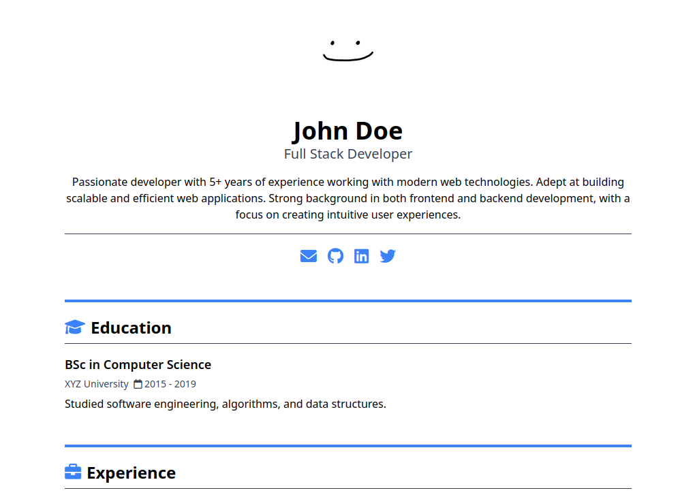

# Jekyll Resume Builder

A customizable, easy-to-use Jekyll-based resume template designed to generate a clean, modern resume with support for personal sections, links, ratings, and more. This template uses YAML for data management.



## Features

- **Customizable Sections**: Define sections such as "Experience", "Education", "Skills", etc.
- **Rating System**: Display skills or experiences with a 1-5 star rating, including half-stars.
- **Social Links**: Include icons for social media and email.
- **Dynamic Theme**: Set your theme colors directly through `_config.yaml`.
- **Font Awesome Icons**: Use [Font Awesome](https://fontawesome.com) icons for your sections.

## Requirements

- [Ruby 2.7 or higher](https://jekyllrb.com/docs/installation/#requirements)
- [Jekyll 4.0 or higher](https://jekyllrb.com/docs/installation/#requirements)

## Installation

1. **Use the template or fork the repository**

2. **Clone your copy**:
   ```bash
   git clone https://github.com/yourusername/jekyll-resume.git
   cd jekyll-resume
   ```

3. **Install dependencies**:
   ```bash
   bundle install
   ```

4. **Configure your resume**:
   - Open the `resume.yaml` file and fill in your details (name, title, social links, etc.).
   - Add or modify sections in the `sections` key to fit your needs.
   - Customize the `_config.yaml` for theme colors, fonts, and other settings.

5. **Serve the site locally**:
   ```bash
   bundle exec jekyll serve
   ```

6. Open your browser and go to `http://localhost:4000` to see your resume.


## Customizing the Resume

You can easily adjust the following sections:

- **Basic Info**: Set your name, title, description, and avatar in `resume.yaml`.
- **Sections**: Each section can have a title, icon, description, and list of items (e.g., jobs, skills, projects).
- **Social Links**: Define social media accounts and links in the `social` array.
- **Rating**: Add a rating (1-5) for specific items (e.g., skills, experience) using the `rating` key.

### Example `resume.yaml`

```yaml
name: John Doe
title: Software Developer
description: Passionate about building scalable applications and solving complex problems.
avatar:
  enabled: true
  src: "/assets/john-doe.jpg"
email: "john.doe@example.com"
social:
  - url: "https://github.com/johndoe"
    icon: "fab fa-github"
  - url: "https://www.linkedin.com/in/johndoe"
    icon: "fab fa-linkedin"
sections:
  - Experience:
      icon: "fas fa-briefcase"
      content:
        - title: "Software Engineer"
          company: "Tech Corp"
          subtitle: "January 2020 - Present"
          description: "Worked on building scalable cloud applications using microservices architecture."
          rating: 5
        - title: "Junior Developer"
          company: "Web Solutions"
          subtitle: "June 2018 - December 2019"
          description: "Assisted in developing web applications and maintaining client projects."
          rating: 4
  - Skills:
      icon: "fas fa-cogs"
      content:
        - title: "Programming Languages"
          description: "Python, Ruby, JavaScript"
          rating: 5
        - title: "Web Development"
          description: "HTML, CSS, JavaScript, React"
          rating: 4
```

## Customizing the Theme

To customize the theme colors and fonts, modify the `_config.yaml` file. This project uses [Tailwind CSS colors](https://tailwindcss.com/docs/colors) for defining theme colors.

- **Primary Color**: Set `primary_color` to the color you want for headings, links, and icons (e.g., `blue-500`, `green-600`).
- **Secondary Color**: Set `secondary_color` to adjust borders and secondary elements (e.g., `gray-400`, `yellow-500`).
- **Background Color**: Set `background_color` to define the background color of the resume (e.g., `white`, `gray-100`).
- **Text Color**: Set `text_color` to specify the default text color used across the resume (e.g., `black`, `slate-700`).
- **Font**: Choose from a list of web-safe fonts to customize the overall look.

### Example `_config.yaml`

```yaml
resume:
  theme:
    primary_color: blue-600
    secondary_color: gray-400
    background_color: white
    text_color: slate-800
    font: sans
```